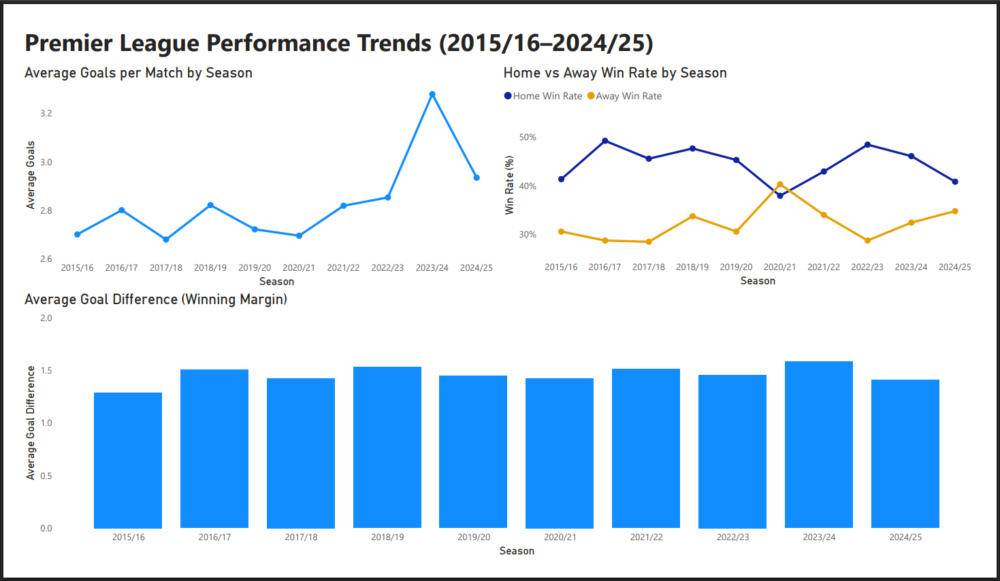
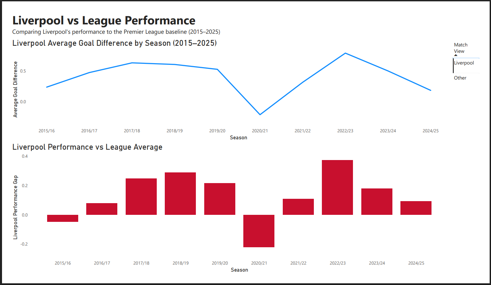

# ⚽ Premier League Performance Analysis (2015–2025)

This project analyses **10 seasons of Premier League match data** using Python and Power BI to explore scoring trends home advantage and team performance across the league.

The goal of the project was to follow a typical **data analysis workflow** starting from raw match data through to an interactive dashboard that clearly communicates insights.

A key focus of the analysis is comparing **Liverpool’s performance against the overall Premier League average** to understand how the team has performed relative to the league baseline across different seasons.

---

# 🛠 Tools Used

The following tools were used throughout the project:

* **Python**
* **Pandas**
* **Jupyter Notebook / Google Colab**
* **Power BI**
* **GitHub**

Python was used for data preparation feature engineering and exploratory analysis while Power BI was used to build the final interactive dashboard.

---

# 📊 Dataset

The dataset contains **Premier League match results from the 2015/16 season to the 2024/25 season**.

The data includes:

* Home and away teams
* Goals scored
* Match outcomes
* Season labels

The data was cleaned and prepared in Python before being used for analysis and visualisation.

---

# ❓ Business Questions

The analysis focuses on several key questions:

* How have **goals per match changed across Premier League seasons**?
* How strong is the **home advantage** in the league?
* Has the **competitiveness of matches changed over time**?
* How does **Liverpool’s average goal difference compare to the league average**?
* In which seasons did Liverpool **outperform or underperform the league baseline**?

These questions help explore both **league-wide trends and individual team performance**.

---

# 🔎 Project Workflow

### 1. Data Cleaning

Match data from multiple seasons was loaded into Python and cleaned using Pandas. Column names were standardised and season labels were created to allow easier analysis across years.

### 2. Feature Engineering

Several additional features were created to support analysis including:

* Goal difference
* Total goals per match
* Absolute goal difference (winning margin)
* Home and away win indicators

These features helped highlight patterns in scoring and match competitiveness.

### 3. Exploratory Data Analysis

Exploratory analysis was carried out in Python to investigate trends in goals home advantage and match competitiveness across the dataset.

### 4. Dashboard Development

The results of the analysis were visualised using Power BI through an interactive dashboard designed to communicate insights clearly.

---

# 📈 Dashboard

## Premier League Trends



This dashboard highlights league-wide patterns including:

* Average goals scored per match
* Home vs away win rates
* Average winning margin across seasons

These metrics provide a high level view of how the Premier League has evolved over the past decade.

---

## Liverpool vs League Performance



This view compares Liverpool’s average goal difference with the overall league average.

Key observations include:

* Liverpool outperforming the league baseline during stronger seasons such as **2018/19 and 2022/23**
* A noticeable dip in performance during the **2020/21 season**

---

# 🗂 Repository Structure

```
Premier-League-Performance-Analysis

Dashboard/   Power BI dashboard
Data/        Dataset used for analysis
Notebooks/   Python analysis notebook
Visuals/     Dashboard screenshots
README.md
```

---

# 🎯 Why This Project

This project was created as part of building a **data analytics portfolio** while preparing for **data analyst apprenticeship opportunities**.

It demonstrates the ability to:

* work with real datasets
* clean and prepare data
* perform exploratory analysis
* build dashboards to communicate insights

# ▶️ How to Run the Project

1. Clone this repository

2. Open the Python notebook in the `Notebooks` folder to view the data preparation and exploratory analysis.

3. Open the Power BI dashboard file in the `Dashboard` folder to explore the visualisations.

The notebook contains the steps used to clean the dataset and create the features used in the final dashboard.
